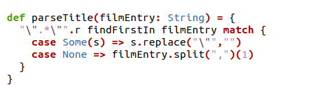
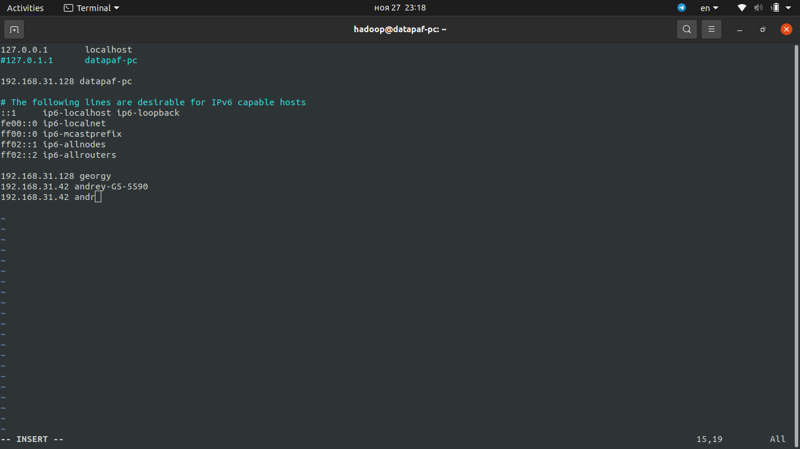
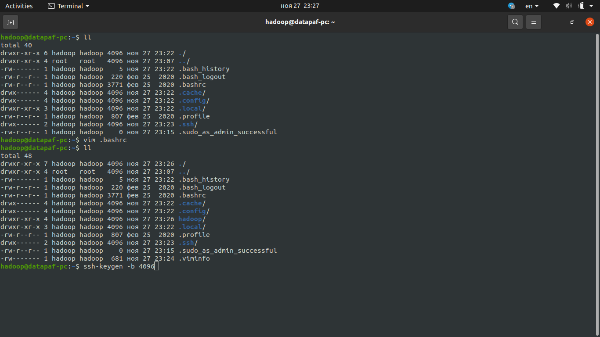
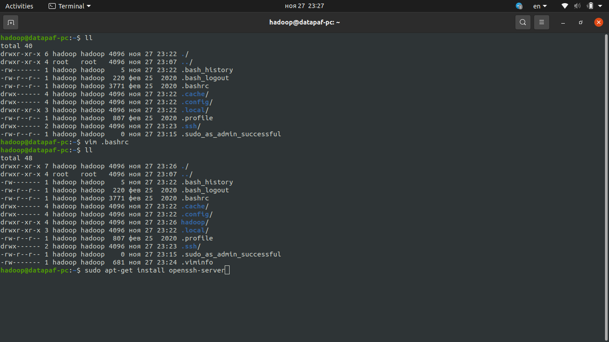
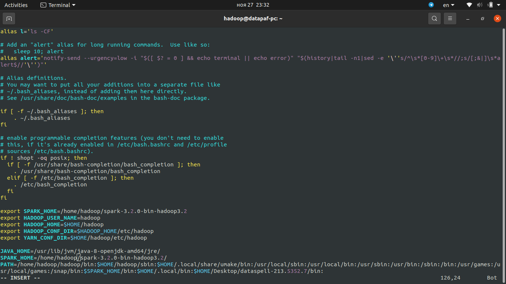

# IBD Assignment

# Authors

**Small Data Team**

- *Andrey Palaev* (a.palaev@innopolis.university)
    
    Programming
    
- *Dinislam Gabitov* (d.gabitov@innopolis.university)
    
    Deployment
    
- Georgy Andryushchenko (g.andryushchenko@innopolis.university)
    
    Report Composing
    

# Introduction

In order to become more experienced in working with Hadoop, Spark, MLlib and Scala our team finalized the implementation of the movie recommender system running on Spark.

In this report we would like to present the solution with the achieved results and their corresponding analysis.

# Solution Description

## General System Description

The recommender system takes a directory as an input that contains 4 files: `movies2.csv`, `ratings2.csv`, `user_ratings.tsv`, `for_grading.tsv`. It also takes the flag to consider preferences while making a prediction.

At first it asks if the user would like to load the preferences from the file instead of interrogation. If the answer is positive than the system loads the preferences and append it to the training dataset. Otherwise, it interrogates about the movies from `for_grading.tsv` and also appends the data to the dataset. The model learns afterwards.

After the learning the system makes a prediction on the test predictors, calculates the test error and baseline error and outputs recommendations for the user. 

## Detailed System Description

- Within this part of the code we check whether there are quotes in the entry. If there are ones then we take everything between the quotes. Otherwise, we split the line on the commas and take the name of the movie.
    
    
    

- Baseline error: for each movie we find its baseline and calculate RMSE.
    
    
    

- Exclude from the recommendations the movies that have already been graded by the user.
    
    
    

- Get rid of the movies that has less than 75 reviews.
    
    
    
- Before interrogation we suggest the user to load preferences from a file
    
    
    

## Deployment on Private Network Hadoop Cluster

The recommender system has been run on the two laptops connected to the same Wi-Fi hotspot.

Here is the process of setting up and running:

1. In both hosts we create a new user `hadoop` with its password, home directory, and sudo rights
    
    `$sudo useradd -m hadoop`
    
    `$sudo passwd hadoop`
    
    `$sudo adduser hadoop sudo`
    
    `$su hadoop`
    
2. set up the hostnames in the `/etc/nosts` file
    
    On both hosts we deleted the line with 127.0.1.1 and added these lines:
    
    `192.168.31.42 andrey-G5-5590`
    
    `192.168.31.42 andr`
    
    `192.168.31.128 georgy`
    
    `192.168.31.128 datapaf-pc`
    
    
    
    
    
3. One of the hosts wasn't able to ssh to another host, so we generate an ssh public key, installed the ssh-server and copied to another host
    
    
    
    
    
    
    
    
    
    
    
4. On both hosts in `~/.bashrc` file add the following configuration for Spark and Hadoop
    
    
    
    
    
5. Set up Hadoop `tmp` directory and replication factor in `hdfs-site.xml`
    
    
    
6. Set up the namenode in `core-site.xml`
    
    
    
7. Set up YARN's node manager and resource manager in `yarn-site.xml`
    
    
    
8. Set up the following settings for MapReduce
    
    
    
9. Add the following workers
    
    
    
10. Distribute the configurations to all the hosts
11. Run HDFS by `start-dfs.sh` and check the working nodes by `hdfs dfsadmin -report`
    
    
    
    
    
12. Start YARN by running `start-yarn.sh`
13. Check that the node really work for YARN
    
    
    

## What Could Have Been Done Differently?

### Code

Movies filtering may be done differently. Instead of setting up the lower bound for the number of reviews equal to 75, it may be equal to another value (for example, 100).

The parameters of the model may also be different.

### Deployment

Whlie deploying on the private network cluster we could host Hadoop components on each host's virtual machine. We tried to do it but due to the problems with the proper setup of the bridged adapter it's not possible to successfully run the recommender system on such cluster.

# Results

## Achieved Results

### Running the System on a Local Hadoop Cluster

- Running the system without checking the user's preferences
    
    
    
- Loading the user's preferences from the file
    
    
    
    
    
- Loading the preferences by interrogating the user
    
    
    
    
    

### Running the System on Private Network Hadoop Cluster

- Running the system without checking the user's preferences
    
    
    
    
    
1. Run the recommender system with loading the grades from the file
    
    
    
    
    
    
    
2. Run the recommender system with getting the grades from keyboard input
    
    
    
    
    
    
    

## Analysis of the Results

Discovering how rank affects the error of the model. All ranks were tested on the same `user_ratings.tsv` file

- Rank = 10

- Rank = 20

- Rank = 30

- Rank = 40

- Rank = 50

- Rank = 60

- Rank = 100

So, in the results, we can see that baseline error in all cases is almost the same, while test errors (after training) are different. The minimum test error is on rank 40. That means all ranks < 40 - underfit and all ranks > 40 - overfit.

### Conclusion

The implementation of the system was successfully completed and deployed on both local and private network Hadoop clusters. Different configurations of the model were tested and compared to find the best configuration.
